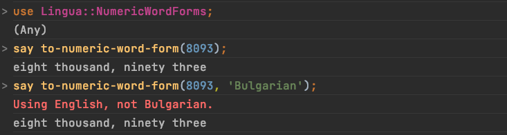
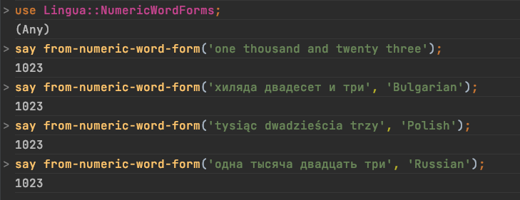

# Raku Lingua::NumericWordForms

This repository provides a Raku package with functions for the 
generation, parsing, and interpretation of numeric word forms in different languages.

The initial versions of the code in this repository can be found in the GitHub repository \[AAr1\].

The Raku package 
[`Lingua::Number`](https://github.com/labster/p6-Lingua-Number), [BL1],
provides word forms (cardinal, ordinal, etc.) generation in many languages. 
(But at least for one language the produced forms are incorrect.)

The Raku package 
[`Lingua::EN::Numbers`](https://github.com/labster/p6-Lingua-Number), [SS1],
also provides word forms (cardinal, ordinal, etc.) generation in English. 

The parsers and interpreters of this package can be seen as complementary
to the functions in [BL1, SS1].

**Remark:** Maybe a more complete version of this package should be merged with 
[`Lingua::Number`](https://github.com/labster/p6-Lingua-Number), [BL1].

## Installation

**1.** Install Raku (Perl 6) : https://raku.org/downloads . 

**2.** Make sure you have Zef Module Installer. 
 
   - Type in `zef --version` in the command line.
   - Zef Module Installer can be installed from : https://github.com/ugexe/zef .

**3.** Open a command line program. (E.g. Terminal on Mac OS X.)

**4.** Run the command:

```
zef install https://github.com/antononcube/Raku-Lingua-NumericWordForms.git
```

## Examples

Generation of numeric word forms:

```perl6
use Lingua::NumericWordForms;
say to-numeric-word-form(8093);
say to-numeric-word-form(8093, 'Bulgarian'); # not implemented yet
say to-numeric-word-form(8093, 'Russian');   # not implemented yet
```
Here is a screenshot of the results:



Interpretation of numeric word forms:

```perl6
use Lingua::NumericWordForms;
say from-numeric-word-form('one thousand and twenty three');
say from-numeric-word-form('хиляда двадесет и три', 'Bulgarian');
say from-numeric-word-form('tysiąc dwadzieścia trzy', 'Polish');
say from-numeric-word-form('одна тысяча двадцать три', 'Russian');
say from-numeric-word-form('mil veintitrés', 'Spanish');
```
Here is a screenshot of the results:



For more examples see the file 
[NumericWordForms-examples.raku](./examples/NumericWordForms-examples.raku).

Translation from one language to another:

```raku
‌‌say translate-numeric-word-form('хиляда двадесет и три', 'Bulgarian' => 'English');
```

(Currently that functions translates to English only.)

## Roles

This package provides (exports) roles that can be used in grammars or roles in other packages, applications, etc.

For example, see the roles:

```
Lingua::NumericWordForms::Roles::Bulgarian::WordedNumberSpec
Lingua::NumericWordForms::Roles::English::WordedNumberSpec
```

A grammar or role that does the roles above should use the rule:

```
<numeric-word-form>
```

For code examples see the file 
[Parsing-examples.raku](./examples/Parsing-examples.raku).

**Remark:** The role `Lingua::NumericWordForms::Roles::WordedNumberSpec` and the corresponding
actions class `Lingua::NumericWordForms::Actions::WordedNumberSpec` are "abstract".
They were introduced in order to have simpler roles and actions code 
(and non-duplicated implementations.) Hence, that role and class should not be used in
grammars and roles outside of this package.

## TODO

The following TODO items are ordered by priority, the most important are on top. 
 
1. [ ] Expand parsing beyond 1 trillion

2. [ ] Automatic determination of the language

3. [ ] Word form generation:
   - [ ] English
   - [ ] Bulgarian
   - [ ] Russian
   - [ ] General algorithm
   
4. [ ] Implement parsing of ordinal numeric word forms 

5. [ ] Implement parsing of year "shortcut" word forms, like "twenty o three" 

6. [ ] Implement parsing of numeric word forms for rationals, like "five twelfths" 

7. [X] Translation function (from one language to another)


## References

[AAr1] Anton Antonov, 
[Raku::DSL::Shared](https://github.com/antononcube/Raku-DSL-Shared). 

[BL1] Brent "Labster" Laabs, 
[`Lingua::Number`](https://github.com/labster/p6-Lingua-Number).

[SS1] Larry Wall, Steve Schulze, 
[Lingua::EN::Numbers](https://github.com/thundergnat/Lingua-EN-Numbers).
